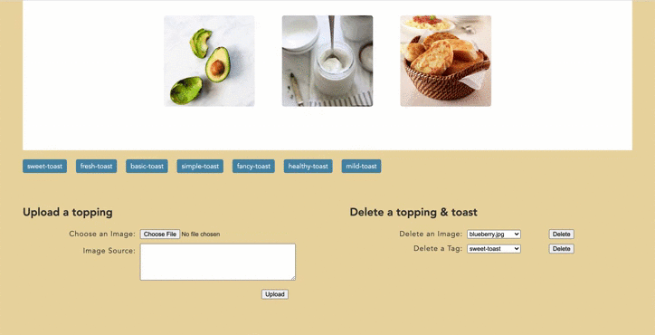

# [tasty-toast](https://calm-springs-24405.herokuapp.com/index.php)

[Tasty toast](https://calm-springs-24405.herokuapp.com/index.php) is a data-driven web application that sorts image and enables customization of image tags using PHP and SQL.

This is the final project I've done for **INFO 2300**, Intermediate Design and Programming for the Web. I received 148 out of 150. 

* [Features](##features)
* [Database Schema Design](#database-schema-design)
* [Requests](#requests)
* [License](#license)

## Features

* The photo gallery shows all the images of the toppings.
* Once the user clicks a tag (type of a toast), one can view all the toppings for the toast.


* Once the user clicks an image (a topping), one can view it's info and all the tags belong to the image.


* Users can upload an image (topping) to the gallery. The source of the images is a required input.



* Users can add both a new tag and an existing tag to the image. They can also delete an existing tag from the image.


* Users can create a new tag or delete an existing tag. 

## Database Schema Design

This is summary of the database. To see seed data and the actual code, refer to **init.sql**.

##### images

| id         | 1, 2, 3 ... ( *INTEGER, PRIMARY KEY, UNIQUE, NOT NULL, AUTO INCREMENT* )                  |
|------------|-------------------------------------------------------------------------------------------|
| image_name | bread, blueberry, banna, butter, cheese ... ( *TEXT, UNIQUE, NOT NULL, MAX LENGTH = 20* ) |
| image_ext  | .jpg, .png ... ( *TEXT, NOT NULL* )                                                       |
| image_src  | wikipedia, pinterest ... ( *TEXT, NOT NULL* )                                             |

##### tags
| id       | 1, 2, 3 ... ( *INTEGER, PRIMARY KEY, UNIQUE, NOT NULL, AUTO INCREMENT* )    |
|----------|-----------------------------------------------------------------------------|
| tag_name | sweet, fresh, healthy, smooth ( *TEXT, UNIQUE, NOT NULL, MAX LENGTH = 20* ) |

##### images_tags
| image_id | 1, 2, 3 ... ( *INTEGER, FOREIGN KEY, NOT NULL* ) |
|----------|--------------------------------------------------|
| tag_id   | 1, 2, 3 ... ( *INTEGER, FOREIGN KEY, NOT NULL* ) |

## Requests

These are some of the requests used in the website. To see more, refer to **gallery.php**, **index.php**, and **single.php**. 

**Request**: add an existing tag to an image
- Type: POST
- Initiate: form
- Param: image_id, tag_id
```
<?php
// Add an existing tag that belongs to the image
if (isset($_POST["add_exist_tag"])) {
    $image_id = $_GET['calm'];
    $tag_name = $_POST['tag_exist'];

    $sql = "SELECT * FROM tags WHERE tag_name = :tag_name";
    $params = array(':tag_name' => $tag_name);
    $result = exec_sql_query($db, $sql, $params)->fetchAll();
    $tag_id = $result[0]['id'];

    $sql = "SELECT * FROM images_tags WHERE image_id =:image_id AND tag_id = :tag_id";
    $params = array(':image_id' => $image_id, ':tag_id' => $tag_id);
    $result = exec_sql_query($db, $sql, $params)->fetchAll();

    if (empty($result)) {
        $sql = "INSERT INTO images_tags (image_id, tag_id) VALUES (:image_id, :tag_id)";
        $params = array(':image_id' => $image_id, ':tag_id' => $tag_id);
        $result = exec_sql_query($db, $sql, $params);
    }
}
?>
```

**Request**: delete an image
- Type: POST
- Initiate: form
- Param: image_id, image_name, id
```
<?php
// Delete an image
if (isset($_POST["delete_image"])) {
    $image_name = $_POST['image_delete'];

    $sql = "DELETE FROM images_tags WHERE image_id = :image_id";
    $params = array(':image_id' => $image_id);
    $result = exec_sql_query($db, $sql, $params)->fetchAll();

    $sql = "SELECT * FROM images WHERE image_name = :image_name";
    $params = array(':image_name' => $image_name);
    $result = exec_sql_query($db, $sql, $params)->fetchAll();
    $image_id = $result[0]['id'];

    $sql = "DELETE FROM images WHERE id = :id";
    $params = array(':id' => $image_id);
    exec_sql_query($db, $sql, $params)->fetchAll();

    if($result){
    $result = $result[0];
    unlink(IMAGE_UPLOADS_PATH. $result['id'] . "." . $result['image_ext']);
    }

}
?>
```

**Request**: view a single image and its tags
- Type: GET
- Initiate: query string param URL
- Param: image_id
```
<?php
// Display a clicked image and its information
$image_id = $_GET['calm'];

$sql = "SELECT * FROM images WHERE id = :id";
$params = array(':id' => $image_id);
$records = exec_sql_query($db, $sql, $params)->fetchAll(PDO::FETCH_ASSOC);
// Citation provided in init.sql
foreach($records as $record){
    echo "<h2 class='image_name'>" . ucfirst($record["image_name"]) . "</h2>";
    echo "";
    echo "<p class='image_src'> Source: " ."<a href=\"". $record["image_src"]. "\">Link</a> </p>";
}
?>
```

## License

* [yubinary](https://github.com/yubinary)
