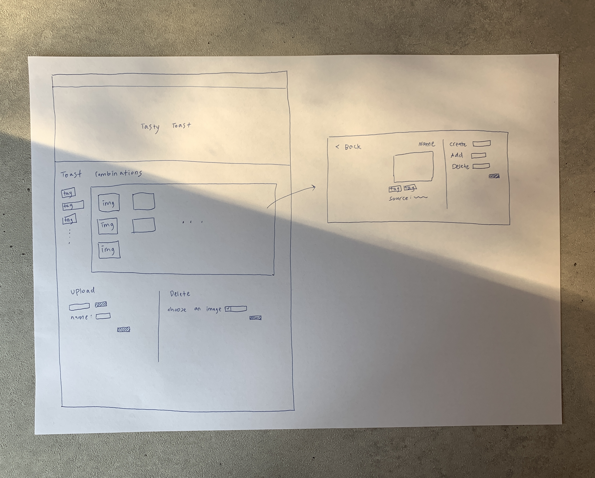
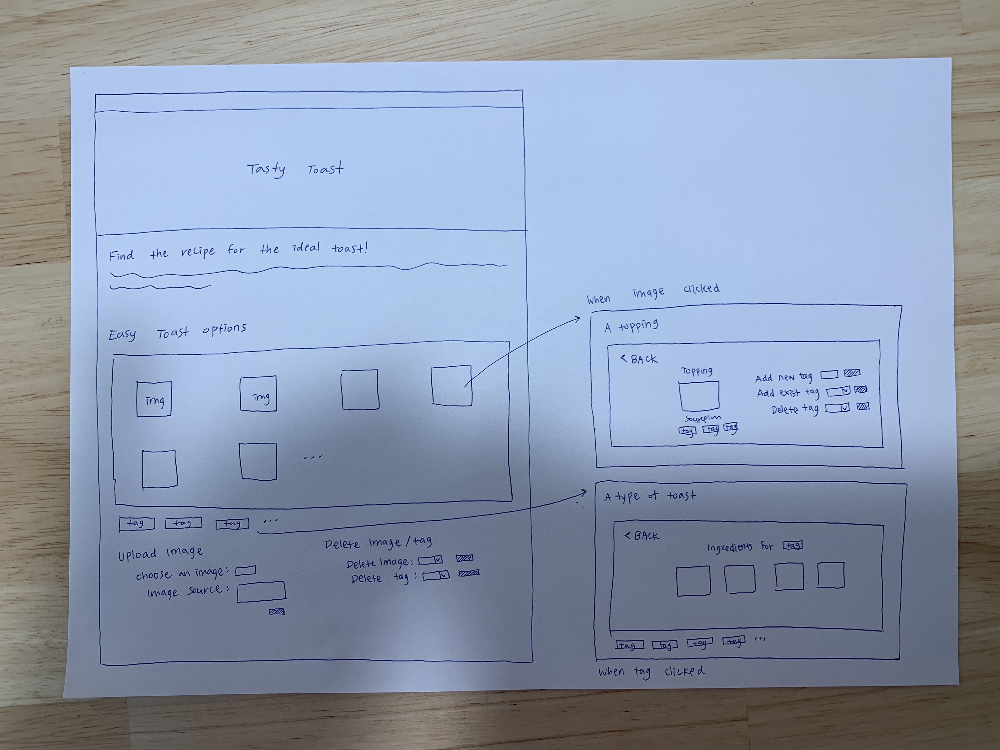

# Project 3: Design Journey

Be clear and concise in your writing. Bullets points are encouraged.

**Everything, including images, must be visible in VS Code's Markdown Preview.** If it's not visible in Markdown Preview, then we won't grade it.

# Design & Plan (Milestone 1)

## Describe your Gallery (Milestone 1)
> What will your gallery be about? 1 sentence.
The gallery will display the pictures of the things one need to cook the dish.

> Will you be using your existing Project 1 or Project 2 site for this project? If yes, which project?
No

> If using your existing Project 1 or Project 2, please upload sketches of your final design here.


## Target Audience(s) (Milestone 1)
> Tell us about your target audience(s).
My targeted audience is those who wants to visually acquire ideas for toast topping. Each toppings will be displayed as an image, if a tag, which is a type of a toast, is clicked, its following toppings will be sorted and displayed. A topping with multiple tags should be priority of their shopping.


## Design Process (Milestone 1)
> Document your design process. Show us the evolution of your design from your first idea (sketch) to design you wish to implement (sketch). Show us the process you used to organize content and plan the navigation (card sorting), if applicable.
> Label all images. All labels must be visible in VS Code's Markdown Preview.
> Clearly label the final design.

Contents
- Basic introduction of the website
- Image gallery
- List of the tags
- Upload an image
- Delete an image




I added the introduction of the website at the beginning so the targeted audience would understand the purpose of the image gallery better. Also, I decided to placed the list of tags to the bottom because as the number of tags increases,the height of the left side of the image gallery will increases, it would not be visually pleasing.


## Design Patterns (Milestone 1)
> Explain how your site leverages existing design patterns for image galleries.
> Identify the parts of your design that leverage existing design patterns and justify their usage.
> Most of your site should leverage existing patterns. If not, fully explain why your design is a special case (you need to have a very good reason here to receive full credit).

I used < logo which is a simplified version of an back-arrow. One of the most famous photo gallery service, Google Photos, uses this design pattern. The users will identify this logo as the button to go back to the screen they were viewing. Also, the existing image galleries elaborate with the features which when the users click the image, they view details of the image. I leverage the pattern into my image gallery.

## Requests (Milestone 1)
> Identify and plan each request you will support in your design.
> List each request that you will need (e.g. view image details, view gallery, etc.)
> For each request, specify the request type (GET or POST), how you will initiate the request: (form or query string param URL), and the HTTP parameters necessary for the request.

- Request: view all images
    - Type: GET
    - Initiate: query string param URL
    - Param: images;

    ```
    select from images;
    execute sql query;
    foreach execution{
        echo an image that is linked to query string param URL of image's id;
    }
    ```

- Request: view all tags
    - Type: GET
    - Initiate: query string param URL
    - Param: tags

    ```
    select from tags;
    execute sql query;
    foreach execution{
        echo a tag that is linked to query string param URL of tag's id;
    }
    ```
- Request: view all images for a tag
    - Type: GET
    - Initiate: query string param URL
    - Params: tag_id
    ```
    GET image_id from URL

    select from images where id = selected tag's id;
    parmater for tag_id;
    execute sql query;
    foreach execution{
        array for http_build_query();
        echo an image that is linked to query string param URL of image's id;
    }
    ```

- Request: view a single image and its tags
    - Type: GET
    - Initiate: query string param URL
    - Param: image_id
    ```
    GET image_id from URL

    select from images where id = selected image's id;
    parmater for image_id;
    execute sql query;
    foreach execution{
        array for http_build_query();
        echo the image that is linked to query string param URL of image's id;

    select from tags where id = selected image's id;
    parmater for image_id;
    execute sql query;
    foreach execution{
        array for http_build_query();
        echo the tags that is linked to query string param URL of tag's id;
    }
    ```

- Request: upload an image
    - Type: POST
    - Initiate: form
    - Param: image_name, image_ext, image_src

```
    if(the upload_image POST succeed){
        store the file input in a variable;
        sanitize the source input;
        if (file exists){
            store a name in a variable;
            store a extension in a variable;
            insert into images the values;
            parameter for image_name, image_ext, image_src;
        }
    execute sql query;
    if (executed){
        add an id as the last one
        move to the folder
    }
    }
```

- Request: delete an image
    - Type: POST
    - Initiate: form
    - Param: image_id, image_name, id

```
    if(the delete_image POST succeed){
        store the image name POST in a variable;
        sanitize the source input;

        delete from images_tags where image_id is the image_id selected;
        parameter for image_id;
        execute sql query;

        select from images where image_name is the image_name selected;
        parameter for image_name;
        execute sql query;
        match the image_id to the image_name selected;

        delete from images where image_id is the image_id selected;
        parameter for id;
        execute sql query;

        if(executed){
            unlink the image file from disk
        }
    }
```


- Request: delete a tag
    - Type: POST
    - Initiate: form
    - Param: tag_name, tag_id, id

```
    if(the delete_tag POST succeed){
        store the tag name POST in a variable;

        select from tags where tag_name is the tag_name selected;
        parameter for tag_name;
        execute sql query;

        delete from images_tags where tag_id is the tag_id selected;
        parameter for tag_id;
        execute sql query;

        delete from tags where id is the id selected;
        parameter for id;
        execute sql query;
    }
```

- Request: add an existing tag to an image
    - Type: POST
    - Initiate: form
    - Param: image_id, tag_id
```
    if(the add_exist_tag POST succeed){
        store a image_id GET in a variable;
        store a tag_id POST in a variable;

        select from tags where tag_name is the tag_name selected;
        parameter for tag_name;
        execute sql query;

        select from images_tags where image_id is the image_id selected and tag_id is the tag_id selected;
        parameter for image_id, tag_id;
        execute sql query;

        if (executed){
            insert into images_tags the values;
            parameter for image_id, tag_id;
            execute sql query;
        }
```

- Request: add a new tag to an image
    - Type: POST
    - Initiate: form
    - Param: image_id, tag_id, tag_name
```
    if(the add_new_tag POST succeed){
        store the tag name in a variable;
        filter the name;

        select from tags where tag_name is the tag_name selected;
        parameter for tag_name;
        execute sql query;
        if (executed){
            insert into tags the values;
            parameter for tag_name;
            execute sql query;

            store a image_id GET in a variable;
            add an id as the last one
            insert into images_tags the values;
            parameter for image_id, tag_id;
            execute sql query;
        }
```

- Request: remove a tag to an image
    - Type: POST
    - Initiate: form
    - SQL: image_tag, tag_name, image_id
```
    store the tag name in a variable;

    select from images where id is the id selected;
    parameter for id;
    execute sql query;

    if(the remove_tag POST succeed){
        store a image_id GET in a variable;
        store a tag_name POST in a variable;

        delete from tags where tag_name is the tag_name selected;
        parameter for tag_name;
        execute sql query;
        add an id as the last one;

        delete from images_tags where image_id is the image_id selected, tag_id is the tag_id selected;
        parameter for image_id, tag_id;
        execute sql query;
    }
```

## Database Schema Design (Milestone 1)
> Plan the structure of your database. You may use words or a picture.
> Make sure you include constraints for each field.

> Hint: You probably need `images`, `tags`, and `image_tags` tables.

> Hint: For foreign keys, use the singular name of the table + _id. For example: `image_id` and `tag_id` for the `image_tags` table.

images
- id: 1, 2, 3 ... (*INTEGER, PRIMARY KEY, UNIQUE, NOT NULL, AUTO INCREMENT*)
- image_name: bread, blueberry, banna, butter, cheese ... (*TEXT, UNIQUE, NOT NULL, MAX LENGTH = 20*)
- image_ext:.jpg, .png ... (*TEXT, NOT NULL*)
- image_src: wikipedia, pinterest ... (*TEXT, NOT NULL*)

tags
- id: 1, 2, 3 ... (*INTEGER, PRIMARY KEY, UNIQUE, NOT NULL, AUTO INCREMENT*)
- tag_name: sweet, fresh, healthy, smooth (*TEXT, UNIQUE, NOT NULL, MAX LENGTH = 20*)

images_tags
- image_id: 1, 2, 3 ... (*INTEGER, FOREIGN KEY, NOT NULL*)
- tag_id: 1, 2, 3 ... (*INTEGER, FOREIGN KEY, NOT NULL*)


## Database Query Plan (Milestone 1)
> Plan your database queries. You may use natural language, pseudocode, or SQL.
> Using your request plan above, plan all of the queries you need.

- view all images
```
SQL: SELECT * FROM images;
```

- view all images for a tag
```
SQL: SELECT * FROM images INNER JOIN images_tags ON images.id = images_tags.image_id WHERE image_tag.tags_id = "tags.id";
```

- view a single image and its tags
```
SQL: SELECT * FROM tags INNER JOIN images_tags ON tags.tags_id = images_tags.tag_id WHERE images_tags.image_id = "images.id";
```

- upload an image
```
SQL: INSERT INTO images (id, image_name, image_ext, image_src) VALUES (value1, value2, value3);
```

- delete an image
```
SQL: DELETE FROM images WHERE image_name = "image_name";
```

- view all tags
```
SQL: SELECT * FROM tags;
```

- add an existing tag to an image
```
SQL: INSERT INTO images_tags (image_id, tag_id) VALUES (value1, value2);
```

- add a new tag to an image
```
SQL: INSERT INTO tags (tag_id, tag_name) VALUES (value1, value2);
```
```
INSERT INTO images_tags (image_id, tags_id) VALUES (value1, value2);
```

- remove a tag to an image
```
SQL: DELETE FROM images_tags where images_tags = "images_tags";
```


## Code Planning (Milestone 1)
> Plan what top level PHP pages you'll need.

index.php

> Plan what partials you'll need.

No partials needed.

> Plan any PHP code you'll need.

index.php
- upload an image
```
if(the upload_image POST succeed){
        store the file input in a variable;
        sanitize the source input;
        if (file exists){
            store a name in a variable;
            store a extension in a variable;
            insert into images the values;
            parameter for image_name, image_ext, image_src;
        }
    execute sql query;
    if (executed){
        add an id as the last one
        move to the folder
    }
    }
```
- delete an image
```
    if(the delete_image POST succeed){
        store the image name POST in a variable;
        sanitize the source input;

        delete from images_tags where image_id is the image_id selected;
        parameter for image_id;
        execute sql query;

        select from images where image_name is the image_name selected;
        parameter for image_name;
        execute sql query;
        match the image_id to the image_name selected;

        delete from images where image_id is the image_id selected;
        parameter for id;
        execute sql query;

        if(executed){
            unlink the image file from disk
        }
    }
```
- delete a tag
```
    if(the delete_tag POST succeed){
        store the tag name POST in a variable;

        select from tags where tag_name is the tag_name selected;
        parameter for tag_name;
        execute sql query;

        delete from images_tags where tag_id is the tag_id selected;
        parameter for tag_id;
        execute sql query;

        delete from tags where id is the id selected;
        parameter for id;
        execute sql query;
    }
```

- display all images
 ```
    select from images;
    execute sql query;
    foreach execution{
        echo an image that is linked to query string param URL of image's id;
    }
```

- display all tags
```
    select from tags;
    execute sql query;
    foreach execution{
        echo a tag that is linked to query string param URL of tag's id;
    }
```

- upload an image
```
    if(the upload_image POST succeed){
        store the file input in a variable;
        sanitize the source input;
        if (file exists){
            store a name in a variable;
            store a extension in a variable;
            insert into images the values;
            parameter for image_name, image_ext, image_src;
        }
    execute sql query;
    if (executed){
        add an id as the last one
        move to the folder
    }
    }
```

single.php
- add a new tag
```
    if(the add_new_tag POST succeed){
        store the tag name in a variable;
        filter the name;

        select from tags where tag_name is the tag_name selected;
        parameter for tag_name;
        execute sql query;
        if (executed){
            insert into tags the values;
            parameter for tag_name;
            execute sql query;

            store a image_id GET in a variable;
            add an id as the last one
            insert into images_tags the values;
            parameter for image_id, tag_id;
            execute sql query;
        }
```
- add an existing tag
```
    if(the add_exist_tag POST succeed){
        store a image_id GET in a variable;
        store a tag_id POST in a variable;

        select from tags where tag_name is the tag_name selected;
        parameter for tag_name;
        execute sql query;

        select from images_tags where image_id is the image_id selected and tag_id is the tag_id selected;
        parameter for image_id, tag_id;
        execute sql query;

        if (executed){
            insert into images_tags the values;
            parameter for image_id, tag_id;
            execute sql query;
        }
```

- delete a tag
```
    store the tag name in a variable;

    select from images where id is the id selected;
    parameter for id;
    execute sql query;

    if(the delete_tag POST succeed){
        store a image_id GET in a variable;
        store a tag_name POST in a variable;

        delete from tags where tag_name is the tag_name selected;
        parameter for tag_name;
        execute sql query;
        add an id as the last one;

        delete from images_tags where image_id is the image_id selected, tag_id is the tag_id selected;
        parameter for image_id, tag_id;
        execute sql query;
    }
```

gallery.php
- display all images for a tag
```
    GET image_id from URL

    select from images where id = selected tag's id;
    parmater for tag_id;
    execute sql query;
    foreach execution{
        array for http_build_query();
        echo an image that is linked to query string param URL of image's id;
    }
```
- display all tags
```
    select from tags;
    execute sql query;
    foreach execution{
        echo a tag that is linked to query string param URL of tag's id;
    }
```
# Complete & Polished Website (Final Submission)

## Gallery Step-by-Step Instructions (Final Submission)
> Write step-by-step instructions for the graders.
> For each set of instructions, assume the grader is starting from index.php.

Viewing all images in your gallery:
1. Scroll down to the image gallery

View all images for a tag:
1. Scroll down to the tag list and click a tag

View a single image and all the tags for that image:
1. Click an image in the image gallery

How to upload a new image:
1. Scroll down to the upload form
2. Choose an image
3. Write its source
4. Submit the form

How to delete an image:
1. Scroll down to the delete form
2. Select an image
4. Submit the form

How to view all tags at once:
1. Scroll down to the tag list below the image gallery

How to add a tag to an existing image:
1. Click an image in the image gallery
2. Select a tag
4. Submit the form

How to remove a tag from an existing image:
1. Click an image in the image gallery
2. Select a tag
4. Submit the form


## Reflection (Final Submission)
> Take this time to reflect on what you learned during this assignment. How have you improved since starting this class?
I spent tremendous amount of time in both building and polishing the website. I am very confident with how the database work; using JOIN to manipulate data as I wanted was tricky but efficient. I am willing to work on personal projects that could apply the learning from the course. Compared to the beginning of the class, I improved a lot especially that I can handle a myriad of diversity of HTTP requests. I was surprised the amount of requests a single image gallery requires.
